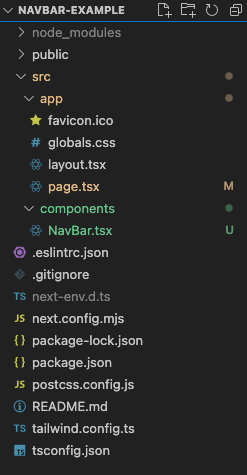

# A guide to building a Responsive Navbar in React and Next.js.

- [A guide to building a Responsive Navbar in React and Next.js.](#a-guide-to-building-a-responsive-navbar-in-react-and-nextjs)
  - [Introduction](#introduction)
  - [Requirements](#requirements)
  - [Project setup](#project-setup)
  - [Creating our NavBar component](#creating-our-navbar-component)
  - [Using the NavBar component](#using-the-navbar-component)
  - [Adding sections to see scrolling in action](#adding-sections-to-see-scrolling-in-action)


## Introduction

Many websites today make use of some form of navigation bar. It's a simple and intuitive way for the user to navigate the website and getting to certain pages/content.

As the web progressed, we are now designing and developing for a mobile first approach. This is due to the significant number of mobile devices using the internet. The term for this approach, is called 'Responsive' design.

When we design and develop using the Responsive approach, content of the website have a different behaviour and display depending on the device's screen size.

Let's look how we can implement a responsive Navbar.

## Requirements

We'll be implementing our Navbar using React.js, and make use of the Next.js framework. For the styling part of things, we will use TailwindCSS.

What is needed to follow along?

* General HTML & CSS knowledge
* Javascript experience
* Understanding of React.js & Next.js
* node.js (>= v20.11.1) installed
* Your favourite IDE (we'll use Visual Studio Code)

## Project setup

To start, we are going to need a project structure for our Next.js app, where we will implement our Navbar component.

In the terminal, let's run the following command:

```bash
npx create-next-app@latest
```
And then, we'll select the following options:

```bash
✔ What is your project named? … navbar-example
✔ Would you like to use TypeScript? … Yes
✔ Would you like to use ESLint? … Yes
✔ Would you like to use Tailwind CSS? … Yes
✔ Would you like to use `src/` directory? … Yes
✔ Would you like to use App Router? (recommended) Yes
✔ Would you like to customize the default import alias (@/*)? … No
```
Once the above process has completed successfully, let's open our new project in the chosen IDE.

We now see the following folder structure:


We'll be using Hero Icons in the project, and this needs to be install. Let's run the following command in the terminal (we need to be in the project root's folder for this):

```bash
npm install @heroicons/react
```

Let's open the page.tsx file under src/app, and remove all the pre-generated code. Then paste the following code.

```javascript
export default function Home() {
  return (
   <main>

   </main>
  );
}

``` 

We also want to remove the pre-generated CSS code. We can remove all the code generated already, and leave the following in globals.css:

```css
@tailwind base;
@tailwind components;
@tailwind utilities;
```


## Creating our NavBar component

With our project ready and setup, let's create a new folder under the src/ directory, and call it 'components'. After creating this folder, create a new file called 'NavBar.tsx'.

We end up with our project structure:



Now we can add our code for our NavBar component. Since we are using TailwindCSS, all the styling will be done within this component.

Let's add the following to our NavBar.tsx file:

```javascript
'use client'

import { useState } from 'react';
import { Bars3Icon, CodeBracketIcon, XMarkIcon } from '@heroicons/react/24/outline';

const NavBar = () => {
  const [isOpen, setIsOpen] = useState(false);
  const [active, setActive] = useState("#home");
  const homeSection = "#home";
  const servicesSection = "#services"
  const aboutSection = "#about"
  const contactSection = "#contact"

  const toggleMenu = () => {
    setIsOpen(!isOpen);
  };

  const scrollToSection = (sectionId: string) => {
    console.log(sectionId)
    setActive(sectionId)
   if (typeof window !== "undefined") {    
       const section = document.querySelector(sectionId);
       if (section !== null) {
        section.scrollIntoView({ behavior: 'smooth' });
       }        
    }
  };

  return (
    <nav className="">
      <div className="container px-4 py-3 mx-auto md:flex md:justify-between md:items-center">
        <div className="flex items-center justify-between">        
        <CodeBracketIcon className="w-16 h-16 text-gray-800" />
        <button className="md:hidden" onClick={toggleMenu}>
          {isOpen ? (
            <XMarkIcon className="w-6 h-6 text-gray-800" />
          ) : (
            <Bars3Icon className="w-6 h-6 text-gray-800" />
          )}
        </button>
        </div>
        <div className={`md:flex ${isOpen ? 'block' : 'hidden'}`}>
          <a className={`block mt-4 md:inline-block md:mt-0 md:ml-6 cursor-pointer ${active === homeSection ? 'text-red-600' : 'text-gray-800'}`} href={homeSection} onClick={() => {scrollToSection(homeSection)}}>Home</a>
          <a className={`block mt-4 md:inline-block md:mt-0 md:ml-6 cursor-pointer ${active === servicesSection ? 'text-red-600' : 'text-gray-800'}`} href={servicesSection}  onClick={() => {scrollToSection(servicesSection)}}>Services</a>
          <a className={`block mt-4 md:inline-block md:mt-0 md:ml-6 cursor-pointer ${active === aboutSection ? 'text-red-600' : 'text-gray-800'}`} href={aboutSection} onClick={() => {scrollToSection(aboutSection)}}>About</a>
          <a className={`block mt-4 md:inline-block md:mt-0 md:ml-6 cursor-pointer ${active === contactSection ? 'text-red-600' : 'text-gray-800'}`} href={contactSection} onClick={() => {scrollToSection(contactSection)}}>Contact</a>          
        </div>
      </div>
    </nav>
  );
};

export default NavBar;
```

## Using the NavBar component

With our NavBar component ready, let's open our page.tsx fiel and add the < NavBar /> componentß by replacing what we have already with:

```javascript
import NavBar from "@/components/NavBar";

export default function Home() {
  return (
    <main>
      <NavBar />
    </main>
  );
}
```

Let's run the project to see our NavBar in action by typing the following command in the terminal:

```bash 
npm run dev
```

In the browser we now see the navigation bar as intended. On a normal desktop sized screen the following appears:


And when we change our screen size to a smaller device screen, the following can be observed:

 

And when it's expanded, we see the  menu items:


## Adding sections to see scrolling in action

In our NavBar component we have a function called scrollToSection(sectionId) which is used to navigate to a specific section within our page. To see how this works, let's replace our current code with the following in our page.tsx file.

```javascript
import NavBar from "@/components/NavBar";

export default function Home() {
  return (
   <main>
    <NavBar />
    <div className="flex flex-col h-screen mt-8">
      <div id="home" className="flex-grow">
        <h1 className="text-red-700 font-bold text-3xl ml-4">Home</h1>      
      </div>
      <div id="services" className="flex-grow h-96 mt-96">
        <h1 className="text-gray-800 font-bold text-3xl ml-4">Services</h1>      
      </div>
      <div id="about" className="flex-grow h-96 mt-96">
        <h1 className="text-red-700 font-bold text-3xl ml-4">About</h1>      
      </div>
      <div id="contact" className="flex-grow h-96 mt-96">
        <h1 className="text-gray-800 font-bold text-3xl ml-4">Contact</h1>      
      </div>
      <div id="footer" className="flex-grow h-96 mt-96">       
        <h1 className="text-red-700 font-bold text-sm text-center">Footer</h1> 
      </div>
    </div>
   </main>
  );
}
```

Now when we click on any of the navigation items, we are smoothly scrolled to the chosen section.